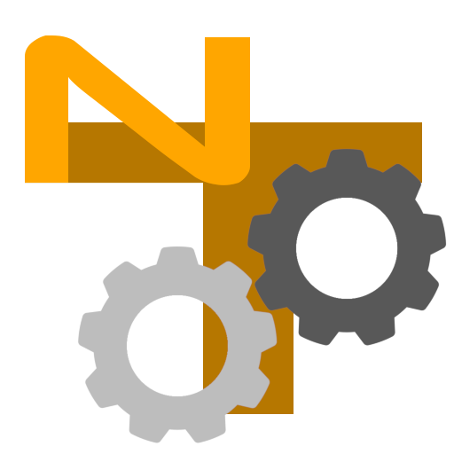

<p align="center">
  
</p>

<h1 align="center">nanoTracker Plugin SDK</h1>

<p align="center">
  <em>Author, validate, package, and ship plugins for nanoTracker — the browser-based MOD/XM-style tracker with a first-class plugin system.</em>
</p>

<p align="center">
  <a href="CHANGELOG.md"></a>
  <a href="LICENSE"></a>
  
  
  
  <a href="AGENTS.md"></a>
</p>

---

## Plugins are first-class

nanoTracker treats plugins as the primary way to extend the tracker.
Plugins ship as ZIP archives — `plugin.json` manifest plus optional
samples, AudioWorklet processors, single-file webview HTML — and the
host loads them at runtime. Two kinds:

| Kind | Extension | Renders as | Use for |
|---|---|---|---|
| 🎹 **Instruments** | `.ntins` | Floating window OR MOD-style sample pads | Synths, samplers, drum machines, anything that plays notes |
| 🎛️ **Pedals** (v4) | `.ntsfx` | Floating window with patch-cable jacks | Effects, mixers, sidechain compressors, CV utilities, anything in the workspace patchbay |

> 🆕 **v4.0 retired the legacy mixer-module FX shape** in favour of
> workspace pedals with multi-port typed jacks, host-injected output
> volume, bypass toggle, and a bidirectional webview write channel.
> Existing v1–v3 FX plugins auto-migrate to pedals on project load —
> see [`docs/13-pedals.md#migrating-a-v3-mixer-module-fx-plugin`](docs/13-pedals.md#migrating-a-v3-mixer-module-fx-plugin).

---

## ⚡ 5-minute quickstart

```bash
# 1. Copy a v4 starter
cp -r plugin-sdk/templates/fx-graph my-pedal
cd my-pedal

# 2. Edit plugin.json — change the name, parameters, DSP graph
$EDITOR plugin.json

# 3. Validate (catches every loader rule before you ship)
node ../plugin-sdk/tools/ntvalidate.mjs .

# 4. Pack into a .ntsfx (FX/pedal) archive
node ../plugin-sdk/tools/ntpack.mjs . --out my-pedal.ntsfx

# 5. In the tracker:  PLUGIN MANAGER  →  + LOAD PLUGIN  →  + ADD TO WS
#    Then drag cables: TRACKER BUS.CH01 → my-pedal.IN → MASTER IN.MAIN
```

That's the whole loop. Everything in this SDK is detail.

---

## 📘 Spec versions

The plugin format is **additive within a major version** — a v4 host
accepts v1 / v2 / v3 plugins unchanged. v4.0 is the one breaking
release: it retired the mixer-module FX shape (auto-migrated) but
left every instrument plugin alone.

| Version | Released | Headline features |
|---|---|---|
| **v4.0** ⭐ | 2026-04 | FX **pedals** (workspace + patch cables), unified typed `ports` (audio / sidechain / cv / gate), bidirectional webview bridge (`paramWrite` / `presetLoad` / `noteOn` / `hostCommand`), capability flags `pedal-v4` / `portsV4` / `webview-writes` |
| v3.5 | 2026-04 | Per-plugin `ui.themeOverride` (11 colour keys), webview `themeChange` event, `forwardEffects` + `acceptsAudioFrames` finished, BPM-synced LFOs |
| v3.4 | 2026-04 | `webview` UI control, host↔iframe `postMessage` bridge |
| v3.3 | 2026-03 | Modulation matrix (multi-target `modRoutes`), tracker effect-column dispatch |
| v3.2 | 2026-03 | `granular` + `wavetable` host-shipped graph node types |
| v3.1 | 2026-03 | Declarative instrument graphs (`dsp.graph`), v3 worklet contract |
| v2 | 2025-Q3 | Modulation routing, v2 node types, UI extensions |
| v1 | 2025-Q1 | Initial format |

Full per-version detail in [`CHANGELOG.md`](CHANGELOG.md). Default
to `schemaVersion: 4` for new authoring.

---

## 🗺️ Where to go next

### 🌱 New to the SDK

1. [`docs/00-getting-started.md`](docs/00-getting-started.md) — your first plugin in five minutes
2. [`docs/01-plugin-format.md`](docs/01-plugin-format.md) — archive layout + schema versions overview

### 🎹 Building an instrument

| Doc | Covers |
|---|---|
| [`02-parameters.md`](docs/02-parameters.md) | Knobs, sliders, curves, groups, presets |
| [`03-ui-controls.md`](docs/03-ui-controls.md) | Every UI control type |
| [`04-instruments.md`](docs/04-instruments.md) | Samples, oscillators, envelopes, LFOs, unison, portamento |
| [`06-instrument-graphs.md`](docs/06-instrument-graphs.md) | v3 per-voice declarative DSP graphs |
| [`08-worklet-v3.md`](docs/08-worklet-v3.md) | v3 worklet contract |

### 🎛️ Building a pedal (v4)

| Doc | Covers |
|---|---|
| [`13-pedals.md`](docs/13-pedals.md) ⭐ | **v4 pedal authoring guide** — workspace topology, multi-port pedals, host-injected chrome, automation |
| [`14-ports.md`](docs/14-ports.md) ⭐ | **Unified typed ports** (audio / sidechain / cv / gate), compatibility matrix, visual reference |
| [`05-fx-graphs.md`](docs/05-fx-graphs.md) | Declarative DSP node + connection language (shared with instruments) |

### 🪟 Embedding HTML / WASM / interactive UIs

| Doc | Covers |
|---|---|
| [`09-webview.md`](docs/09-webview.md) ⭐ | webview control + bidirectional bridge (paramWrite, presetLoad, noteOn, hostCommand) |
| [`10-wasm-in-webview.md`](docs/10-wasm-in-webview.md) | DOOM walkthrough — embedding a WASM binary in a webview plugin |
| [`12-webview-audio.md`](docs/12-webview-audio.md) | `acceptsAudioFrames` PCM route-back |

### 📦 Shipping

| Doc | Covers |
|---|---|
| [`11-packaging.md`](docs/11-packaging.md) | What goes in a `.ntins` / `.ntsfx`, how to use `ntpack` and `ntvalidate` |
| [`tools/README.md`](tools/README.md) | CLI reference for the build tools |

### 📚 Per-field reference

| Doc | Covers |
|---|---|
| [`reference/schema.md`](docs/reference/schema.md) | Every field of every block in `plugin.json` |
| [`reference/host-capabilities.md`](docs/reference/host-capabilities.md) | Every `requires[]` capability flag |
| [`reference/event-bus.md`](docs/reference/event-bus.md) | `VoiceEngineEvent` shapes posted to webview iframes |
| [`reference/worklet-protocol.md`](docs/reference/worklet-protocol.md) | v3 MessagePort host↔processor message types |

---

## 🧪 Worked examples

| Example | What it shows |
|---|---|
| [`v40-mixer-pedal/`](examples/v40-mixer-pedal/) ⭐ | 4-in / 2-out stereo mixer pedal with webview faders (`paramWrite`) + theme override |
| [`v40-compressor-sc/`](examples/v40-compressor-sc/) ⭐ | Compressor with a dedicated `sidechain`-kind input port |
| [`v40-cv-lfo/`](examples/v40-cv-lfo/) ⭐ | Utility pedal with `cv`-kind output for modulating other plugins |
| [`v35-showcase/`](examples/v35-showcase/) | v3.5 instrument showcase — every reserved-for-v2 feature finished |
| [`acid-303/`](examples/acid-303/) | TB-303-flavoured acid bass instrument |
| [`doom-wasm/`](examples/doom-wasm/) | Full DOOM running inside a webview plugin (GPL-2.0) |

---

## 🤖 Working with an AI coding assistant?

This SDK ships with curated agent assets so Claude / Codex / Hermes /
Copilot have the context to help you author a correct plugin on the
first try, without grepping the codebase.

| Folder | For |
|---|---|
| [`.claude/`](.claude/) | Anthropic Claude — SKILL.md skills + slash commands (`/validate`, `/pack`, `/lint`) |
| [`.hermes/`](.hermes/) | Nous Research Hermes Agents — Hermes-format frontmatter (`metadata.hermes.tags`, `requires_toolsets`) |
| [`.agents/`](.agents/) | OpenAI Codex (and any agentskills.io-compatible agent) — SKILL.md + `agents/openai.yaml` sidecars |
| [`CLAUDE.md`](CLAUDE.md) | Full plugin-author orientation — load this as system context |
| [`AGENTS.md`](AGENTS.md) | Terse must-know rules — Codex / Cursor / Aider convergent convention |
| [`.github/copilot-instructions.md`](.github/copilot-instructions.md) | GitHub Copilot pointer |

Six skills mirrored across all three agent folders:

- `scaffold-pedal` — author a v4 pedal from scratch
- `scaffold-instrument` — sample / oscillator / graph instrument
- `scaffold-webview-pedal` — pedal with custom HTML/JS UI
- `add-webview` — add a webview to an existing manifest
- `add-theme-override` — add a per-plugin colour palette
- `migrate-v3-to-v4` — upgrade a legacy FX plugin to v4 pedal

---

## 📁 Folder map

```
plugin-sdk/
├── README.md                 ← you are here
├── CHANGELOG.md              spec version history (v1 → v4)
├── CLAUDE.md  AGENTS.md      LLM coding assistant orientation
│
├── docs/                     narrative documentation (hand-written)
│   ├── 00-getting-started.md
│   ├── 01-plugin-format.md
│   ├── 02-parameters.md
│   ├── 03-ui-controls.md
│   ├── 04-instruments.md
│   ├── 05-fx-graphs.md
│   ├── 06-instrument-graphs.md
│   ├── 07-audioworklets.md
│   ├── 08-worklet-v3.md
│   ├── 09-webview.md
│   ├── 10-wasm-in-webview.md     ★ DOOM walkthrough
│   ├── 11-packaging.md
│   ├── 12-webview-audio.md       v3.5 PCM route-back
│   ├── 13-pedals.md              ★ v4 pedal authoring guide
│   ├── 14-ports.md               ★ v4 unified typed ports
│   └── reference/
│       ├── schema.md
│       ├── event-bus.md
│       ├── host-capabilities.md
│       └── worklet-protocol.md
│
├── tools/                    zero-dependency Node CLIs
│   ├── ntpack.mjs                  zip a source dir into .ntins / .ntsfx
│   ├── ntvalidate.mjs              lint a plugin.json
│   ├── lib/validate.mjs            shared helpers, webview pre-flight
│   └── README.md
│
├── templates/                copy-to-start starter plugins
│   ├── instrument-sampler/
│   ├── instrument-worklet/
│   ├── fx-graph/                   ★ v4 pedal starter
│   └── webview/
│
├── examples/                 fully-worked larger examples
│   ├── v40-mixer-pedal/            ★ 4-in mixer + webview faders
│   ├── v40-compressor-sc/          ★ sidechain port
│   ├── v40-cv-lfo/                 ★ CV output port
│   ├── v35-showcase/               every v3.5 feature
│   ├── acid-303/                   acid bass
│   └── doom-wasm/                  DOOM as a plugin (GPL-2.0)
│
├── .claude/   .hermes/   .agents/   AI assistant skills
└── .github/
    └── copilot-instructions.md
```

---

## 🛠️ Prerequisites

- **Node.js 18 or later** (we use ESM, `fs/promises`, `node:path`)
- `npm install` once inside [`tools/`](tools/) to pull `jszip` + `ajv`
- Any text editor — the SDK has no IDE-specific tooling

You do **not** need the full tracker app cloned to build plugins
with this SDK — just this folder. The tracker is only required for
the final "drop the archive in and play it" step.

---

## ⚖️ Licensing

This SDK is **MIT-licensed**. Plugins built with it can be any
license you want — GPL contagion only applies if you actually link
against GPL code.

The one exception is [`examples/doom-wasm/`](examples/doom-wasm/),
which inherits **GPL-2.0** from the upstream DOOM WebAssembly port
it embeds. See that directory's own
[`LICENSE`](examples/doom-wasm/LICENSE) +
[`CREDITS.md`](examples/doom-wasm/CREDITS.md) for the full
attribution.

A plugin that only uses templates and the built-in nanoTracker DSP
nodes inherits nothing.

---

<p align="center">
  <em>Made with ♥ for the demo-scene, the chip-musicians, and the modular nerds.</em>
</p>
